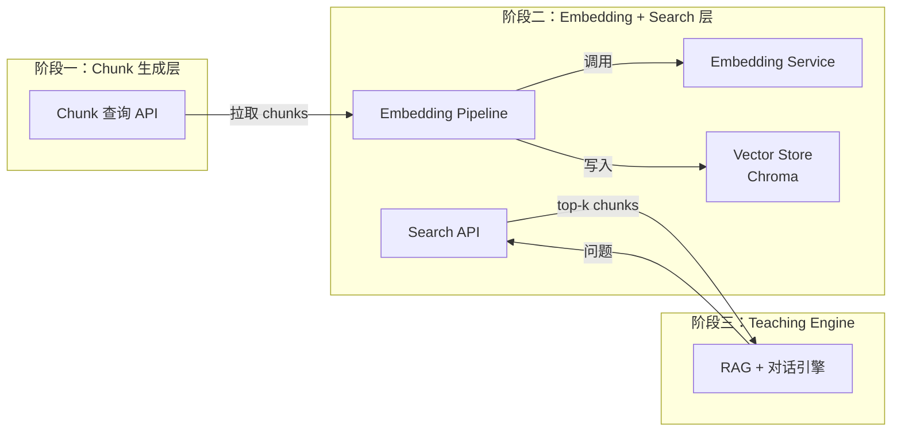

下面给你一份可以直接放进团队 Confluence / docs 的正式《**阶段二技术方案文档（含技术选型原因）**》。
内容风格与你阶段一保持一致，能直接作为开发和架构对齐依据。

---

# 📘 **阶段二技术方案文档（Embedding Service + Vector Store）**

**版本：v1.0**
**作者：架构设计**
**适用范围：阶段二开发启动前的技术规划与决策依据**

---

# 目录

1. 背景与目标
2. 阶段二的整体架构
3. 技术模块说明
   　3.1 Embedding Service（向量生成）
   　3.2 Vector Store（向量数据库）
   　3.3 Chunk Embedding Pipeline（批量向量化）
   　3.4 Search API（语义检索服务）
4. 技术选型及原因
   　4.1 为什么选择 Qwen3-Embedding-0.6B
   　4.2 为什么选择 Chroma（而不是 Milvus/Weaviate/Elastic 等）
   　4.3 为什么 Embedding Service 要单独做成服务
   　4.4 为什么需要批处理 Pipeline，而不是实时 embedding
5. 模块之间的交互
6. 阶段二输出物
7. 阶段一 & 阶段三的接口关系
8. 风险评估与应对
9. 总结

---

# 1. 背景与目标

阶段一已经完成：

* 视频/文档资源的 ingestion
* 课程结构化（Course > Lecture > Section）
* 可向量化的 chunk（Ready-to-Embed schema）
* 验证过的 pipeline（schema 校验）

> 阶段二的目标是让这些 Chunk 能**被检索**。

即：

> **把文本 → 向量 → 写入向量库，并提供稳定的语义检索能力。**

这是阶段三（AI Teacher）的基础。
没有阶段二，AI Teacher 无法做 RAG 推理，无法根据课程回答用户问题。

---

# 2. 阶段二整体架构

```mermaid
flowchart LR
    subgraph S1[阶段一：提供 Chunk]
        A1[GET /courses/:id/chunks]
    end

    subgraph S2[阶段二：向量服务 + 向量库]
        B1[Embedding Service\n(Qwen3-Embedding)]
        B2[Vector Store\nChroma]
        B3[Chunk Embedding Pipeline]
        B4[Search API\n语义检索]
    end

    A1 --> B3
    B3 --> B1
    B3 --> B2
    B4 --> B1
    B4 --> B2

    subgraph S3[阶段三]
        C1[Teaching Engine\nRAG + 对话引擎]
    end

    C1 -->|用户问题 | B4
    B4 -->|相关 chunk | C1
```

在架构上，阶段二是“系统知识的向量化与检索层”，完全独立于阶段三的对话逻辑。

---

# 3. 技术模块说明

阶段二包含四个核心模块：

## 3.1 Embedding Service（向量生成服务）

职责：

* 加载 Qwen3-Embedding-0.6B 模型
* 提供统一接口：`POST /embed`
* 支持批量文本 → 向量（速度更快）
* 在 GPU/CPU 上高性能运行

特性：

* 单一职责（embedding 专注进一个服务）
* 去耦合：不依赖向量库，不依赖业务逻辑
* 后期可替换成更大的 embedding 模型（比如 BGE/Llama3 embedding 等）

实际落地约定：

* MVP 阶段先复用现有 FastAPI 进程，新增 `/embed` 路由和模型单例，暂不拆独立服务；后续 QPS 上来再分离。
* 模型和 tokenizer 以离线方式下载到 `./models/qwen3-embedding-0.6b`，通过环境变量配置：

  ```
  EMBEDDING_MODEL_NAME=qwen3-embedding-0.6b
  EMBEDDING_MODEL_PATH=./models/qwen3-embedding-0.6b
  EMBEDDING_DEVICE=auto  # cuda 优先，失败回落 cpu
  EMBEDDING_MAX_TOKENS=512
  ```

* 服务器默认使用 8GB GPU（如 RTX 4070）+ float16，若 GPU 不可用则自动 fallback 到 CPU 并打印 warning。
* `/embed` 将 texts 做批处理，单次最大 64 条；超长文本按 token（或临时按字符）截断，可在日志中记录被截断比例。

---

## 3.2 Vector Store（向量数据库：Chroma）

职责：

* 存储：chunk_id + embedding + text + metadata
* 支持过滤（course_id/lecture_id/section_id）
* 语义检索（top-k search）
* 按课程划分 collection（隔离存储）

为什么需要向量库，而不是 DB 存 float[]？

* 因为向量搜索需要 ANN（Approx Nearest Neighbor）算法
* ANN engine（HNSW/FAISS）必须落在向量库内部
* Chroma 封装了索引构建、持久化、重建、过滤、分页等能力

部署规范：

* 阶段二 MVP 使用 Chroma `PersistentClient` 内嵌运行，不额外起容器。
* 存储目录统一为 `./data/chroma`，可通过 `CHROMA_DB_DIR` 配置；备份/恢复直接打包该目录。
* 每门课程单独一个 collection，命名 `course_{course_id}`，方便删除/重建。
* metadata 直接复用 Ready-to-Embed 里的核心字段（course/lecture/section/source_type/order_in_section）。
* 同一课程的 embedding pipeline 串行执行，`POST /courses/{id}/embed` 内需加锁，重复请求返回 `already_running`。

---

## 3.3 Chunk Embedding Pipeline（批量向量化流水线）

职责：

* 从阶段一 API 获取 Chunks
* 调用 Embedding Service 做批量 embedding
* 将结果写入 Chroma

特性：

* 按课程触发，非实时
* 可重试
* 有状态（embedding_status）
* 对阶段三透明

Pipeline 是阶段二最关键的任务：
**把阶段一的结构化知识变成可搜索的 vector knowledge base。**

实现要点：

* 直接复用阶段一数据库模型读取 Chunk 表，不走 HTTP；按课程 `SELECT` 并按批分页，缺失文本的记录跳过且日志提示。
* 在 Course 表新增 `embedding_status/embedding_progress/embedding_error` 字段（需新增数据库迁移脚本）。状态枚举：`not_started/pending/running/done/failed`。
* pipeline 运行过程中更新课程状态：`pending → running → done/failed`，progress=已处理 chunk / 全量 chunk。
* 触发方式沿用现有 Worker/Queue：扩展队列元素为 `WorkerTask(type, payload)`，新增 `TaskType.EMBED_COURSE`。`POST /courses/{id}/embed` 入队新任务，Worker loop 区分不同类型执行。

---

## 3.4 Search API（语义检索服务）

职责：

* 接收用户的问题（query）
* query → embedding
* 调用 Chroma 完成向量检索
* 返回 top-k chunk（文本 + metadata + 相似度）
* 作为阶段三 RAG 的入口

特点：

* 统一检索接口（对 Teaching Engine 屏蔽底层细节）
* 支持可选过滤：lecture_id / section_id / source_type
* 内部调用 `/embed` 生成 query 向量，默认 `top_k`=5，最大 20；调用方需携带内部 header（如 `X-Internal-Token`），避免被外部误用。
* 若课程未完成 embedding 或 collection 未创建，返回 400 + `{"error":{"code":"embedding_not_ready"}}`；Chroma/Embedding 服务异常返回 503，并区分 `vector_store_error` / `embedding_service_unavailable`。

---

# 4. 技术选型及原因（核心部分）

## 4.1 为什么选择 **Qwen3-Embedding-0.6B**

| 维度   | 选择原因                        |
| ---- | --------------------------- |
| 性能   | 中文效果非常强，接近 state-of-the-art |
| 模型大小 | 0.6B 可在消费级 GPU 上跑 → 成本低     |
| 鲁棒性  | 对教学内容（视频转录、课件）效果更好          |
| 部署   | 纯文本 embedding，非常轻量          |
| 后续替换 | Qwen 系列 embedding 通用接口统一易替换 |

**这是目前中文 embedding 最适合你的应用场景的选择。**

---

## 4.2 为什么选择 **Chroma**（而不是 Milvus/Weaviate/Elastic）

### Chroma 的优势：

* 🚀 单文件/本地存储，无服务端依赖，部署超级轻
* 🚀 Python first，非常适合 fast iteration
* 🚀 API 简单，适合阶段二 MVP
* 🚀 支持 metadata filter（需要这个做 Lecture/Section 限制）
* 🧪 本地开发 & CI 容易
* 🔧 支持持久化，不用搭集群

### 对比：

| 向量库        | 优点        | 缺点      | 适合阶段   |
| ---------- | --------- | ------- | ------ |
| **Chroma** | 简单、快、本地即可 | 分布式较弱   | MVP～中期 |
| Milvus     | 极强、工业级    | 部署重、依赖多 | 大规模    |
| Weaviate   | 云原生丰富     | 需要服务端   | 中期后    |
| Elastic    | 搜索强       | 向量部分弱   | 不适合本项目 |

> 阶段二重点是“快速落地可用的知识库”，Chroma 是最合适的选择。

---

## 4.3 为什么 Embedding Service 要单独做成服务？

原因如下：

### 1. 与业务解耦（clean architecture）

Embedding 是纯“向量生成层”，不应耦合 ingestion 或检索逻辑。

### 2. 可独立扩缩容（未来支持 GPU/多卡）

例如：

* Worker 多个
* Teaching Engine 并发大
* Embedding 服务可以独立水平扩展

### 3. 后期模型更换独立（不用动 pipeline/检索层）

未来可替换为：

* bge-m3
* jina embedding
* text-embedding-3-large
* 你自己训练的 embedding 模型

---

## 4.4 为什么需要 “批处理 Pipeline”，而不是实时 embedding？

理由非常关键：

### 1. 用户不会等待几十秒完成 embedding

视频源几十分钟 → 生成的 Chunk 可能上百条
实时 embedding 会导致用户体验极差

### 2. embedding 是 CPU/GPU 密集任务

绝对不能放在用户请求链路里

### 3. 操作模式与阶段一 ingestion 一致

一致性强，可复用同一套队列 + Retry 机制

### 4. 后期可以对 embedding 做优化

如：

* 全量重建（batch）
* only update changed chunks
* 部分增量更新

---

# 5. 模块之间的交互（图）



---

# 6. 阶段二输出物（交付物清单）

### 必做（P0）

1. Embedding Service（FastAPI）
2. Vector Store 初始化
3. Chunk Embedding Pipeline（course-level batch）
4. Search API（top-k 语义检索）
5. 每门课程的 embedding 状态字段 & 查看 API
6. structured logging（embedding 也需要）
7. “为课程生成向量”的后台按钮（简单）
8. “查看 embedding 状态”的后台面板

### 高级（P2）

9. embedding 去重/增量更新机制（后续再做）
10. 多模型选择（embedding model switch）

### 6.1 端到端自测流程（开发自检必做）

1. 启动数据库 + FastAPI（uvicorn），确保阶段一 API 可访问。
2. 选取公开视频/PDF，跑完阶段一 ingestion，确认 Chunk 已生成并通过 validator。
3. 调用 `POST /courses/{course_id}/embed` 触发任务，使用 `GET /courses/{course_id}/embedding_status` 轮询直至 `status=done` 且 `progress≈1.0`。
4. 查看日志或用脚本检查 `course_{course_id}` collection 的向量数量 ≈ chunk 数，若不一致需排查。
5. 调用 `POST /courses/{course_id}/search` 验证基础检索、filters、top_k 上限。
6. 对未 embedding 的课程调用 search，需返回 `embedding_not_ready`；停掉 `/embed` 服务后调用 search，应返回 `embedding_service_unavailable` 以验证兜底路径。

---

# 7. 阶段一 / 阶段三的边界关系（非常重要）

| 阶段      | 输入            | 输出                |
| ------- | ------------- | ----------------- |
| 阶段一     | URL/文件        | Chunk（结构化文本）      |
| **阶段二** | Chunk         | Vector Store（可检索） |
| 阶段三     | 用户问题 + 向量检索结果 | AI Teacher 对话输出   |

阶段二是纯技术层，与教学逻辑解耦。

---

# 8. 风险评估与应对

| 风险                  | 影响              | 预案                              |
| ------------------- | --------------- | ------------------------------- |
| embedding 模型 GPU 不够 | 速度变慢            | batch size 动态调节，自动 fallback CPU |
| 向量库损坏/不可读           | 检索失败            | 定期备份 Chroma 存储文件                |
| Chunk 数量大           | embedding 波动    | Pipeline 分 batch，自动重试           |
| 用户问题很短 / 很长         | embedding 质量不稳定 | 搜索前做 query 预处理（后期优化）            |

---

# 9. 总结（一句话）

> 阶段二的技术方案是：
> **使用 Qwen3-Embedding-0.6B 做向量生成，使用 Chroma 存储 embedding，提供统一检索服务，并通过批处理流水线完成课程级向量化。**
>
> 它为阶段三的 AI Teacher 提供了可靠的“知识检索层”，将教学内容转化为可查询的向量空间。

---
