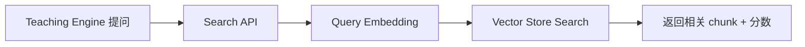

好的，下面给你的是一份 **「阶段二：向量服务 + 向量库」正式开发文档（Development Spec v1.0）**。
文档内容覆盖：

* API 设计（Embedding / Embedding Pipeline / Search）
* 模块架构设计
* 目录结构建议
* 关键流程说明
* 开发任务拆解（含节奏）
* 明确的验收目标

此文档可直接给开发团队开工。

---

# 📘 阶段二开发文档（Development Spec v1.0）

**模块：Embedding Service + Vector Store + Search API
目标：提供课程级向量化与语义检索能力**

---

# 目录

1. 概述与目标
2. 模块架构设计
3. API 设计（正式版）
4. 目录结构建议
5. 核心流程（流程图）
6. 开发任务拆解（按优先级）
7. 验收标准（必须逐条通过）
8. 后续扩展（不在本阶段内）

---

# 1. 概述与目标

阶段一已完成：

* 视频/文档 ingestion
* Sectioning & Chunking
* Ready-to-Embed schema 校验
* 简易管理后台

阶段二的目标非常清晰：

> **把课程的 Chunk 全部向量化（Embedding），存入向量库（Vector Store），并提供稳定的语义检索（Search API），用于阶段三的 AI 教学引擎。**

阶段二是“知识向量层”，关键特点：

* 独立于教学逻辑、对话逻辑
* 以课程为单位生成向量库
* 查询性能高
* 可重试，可观察，可扩展

---

# 2. 模块架构设计（最终版）

阶段二内部模块如下：

```
Stage2
 ├── Embedding Service（向量生成）
 ├── Vector Store（Chroma）
 ├── Chunk Embedding Pipeline（批处理框架）
 └── Search API（语义检索）
```

## 模块职责表：

| 模块                 | 职责                                                | 输入                | 输出                      |
| ------------------ | ------------------------------------------------- | ----------------- | ----------------------- |
| Embedding Service  | 加载 embedding 模型（Qwen3-Embedding-0.6B），提供 `/embed` | 文本数组              | 向量数组                    |
| Vector Store       | 存储 embedding & metadata，支持 top-k 搜索               | vectors, metadata | 检索结果                    |
| Embedding Pipeline | 批量拉取课程 Chunk → 向量化 → 写库                           | 课程 ID             | embedding_status        |
| Search API         | 对阶段三提供语义检索                                        | query / filters   | chunk_list + similarity |

---

# 3. API 设计（正式版，可直接实现）

以下 API 需加入 Phase2 的 FastAPI 后端。

---

## 3.1 Embedding Service API

### **POST /embed**

> 批量文本 → 批量向量

**Request:**

```json
{
  "texts": ["text1", "text2"],
  "model": "qwen3-embedding-0.6b"
}
```

**Response:**

```json
{
  "vectors": [
    [0.123, 0.456, ...],
    [0.789, 0.223, ...]
  ]
}
```

**要求：**

* 批大小建议 32～128
* 文本过长需自动截断（> 512 tokens）
* GPU 优先，CPU fallback
* 内部统一模型调用，不要每次加载
* MVP 阶段与现有 FastAPI 后端共进程部署 `/embed`，启动时加载一次模型，复用单例

**实现约束：**

* 模型文件提前下载到 `./models/qwen3-embedding-0.6b`，通过 `.env` 配置 `EMBEDDING_MODEL_NAME/EMBEDDING_MODEL_PATH/EMBEDDING_DEVICE/EMBEDDING_MAX_TOKENS`。
* 默认使用 8GB GPU（如 RTX 4070）+ float16；若检测不到 GPU，则 fallback 到 CPU 并打 warning。
* tokenizer 与模型一同加载，按 token 截断到 512（临时可用字符数近似，但需留 TODO 切换 token）。
* `/embed` 单次最大 texts=64，超限直接返回 400；每批打 info 日志（调用来源、数量、耗时）。
* 所有内部 API 调用需携带 `X-Internal-Token` 或等价配置项，避免被外部滥用。

---

## 3.2 Embedding Pipeline API（后台触发）

### **POST /courses/{course_id}/embed**

触发“为课程生成向量”。

**Response:**

```json
{
  "course_id": "course_123",
  "status": "embedding_started"
}
```

Pipeline 会进入后台执行：

```
embedding_pending → embedding_running → embedding_done | embedding_failed
```

**实现说明：**

* 任务由现有 Worker 队列执行，需把队列元素抽象为 `WorkerTask(type, payload)`，新增 `EMBED_COURSE` 类型，防止阻塞阶段一流程。
* 同一课程只允许一个运行中的任务：`embedding_status` 为 `running` 时，API 需返回 `409 already_running`。
* 触发 API 仅负责入队并更新 Course 状态至 `pending`，实际计算在后台线程/进程执行。

---

## 3.3 Course Embedding Status API

### **GET /courses/{course_id}/embedding_status**

**Response:**

```json
{
  "course_id": "course_123",
  "status": "embedding_done",
  "progress": 100
}
```

progress 在 MVP 中可以简单：
`已写入向量数量 / 总 chunk 数量`

数据库实现：

* 在 `Course` 模型新增 `embedding_status (Enum) / embedding_progress (Float) / embedding_error (Text)` 字段。
* 需要编写一次性数据库迁移脚本（Alembic/SQLModel）并在部署前执行。
* status 取值：`not_started | pending | running | done | failed`，默认 `not_started`；`progress` 范围 0~1，`error` 存放最近一次失败原因。
* pipeline 运行时应在每批写入后更新 `progress`，失败时落错误信息并改为 `failed`。

---

## 3.4 Search API（阶段三核心依赖）

### **POST /courses/{course_id}/search**

**Request:**

```json
{
  "query": "梯度下降是什么？",
  "top_k": 5,
  "filters": {
    "section_id": "sec_00001"
  }
}
```

**Response:**

```json
{
  "results": [
    {
      "chunk_id": "chunk_001",
      "score": 0.89,
      "text": "梯度下降是一种优化算法…",
      "metadata": {
        "lecture_id": "lec_01",
        "section_id": "sec_00001"
      }
    }
  ]
}
```

**功能要求：**

* 自动对 query 进行 embedding
* 调用 Chroma top-k
* 可过滤 lecture_id / section_id / source_type
* 默认 `top_k`=5，最大 20；调用方需携带内部 header（`X-Internal-Token`）
* 课程未完成 embedding 或 collection 不存在时，返回 400 + `{"error":{"code":"embedding_not_ready"}}`
* Embedding 服务不可用或 Chroma 异常时，返回 503，分别标识 `embedding_service_unavailable`、`vector_store_error`

---

# 4. 目录结构建议（推荐）

```
backend/
 ├── app/
 │    ├── api/
 │    │    ├── embed.py              # /embed
 │    │    ├── embedding_pipeline.py # /courses/{}/embed
 │    │    ├── search.py             # /courses/{}/search
 │    │
 │    ├── services/
 │    │    ├── embedding/
 │    │    │     ├── loader.py       # 模型加载
 │    │    │     ├── embedder.py     # 文本→向量逻辑
 │    │    │
 │    │    ├── vectorstore/
 │    │    │     ├── chroma_client.py
 │    │    │     ├── collection_manager.py
 │    │    │
 │    │    ├── pipeline/
 │    │    │     ├── embedding_pipeline.py
 │    │    │
 │    ├── models/    # 读取阶段一的数据库模型
 │    ├── utils/
 │    ├── config/
 │
 └── scripts/
      └── rebuild_embeddings.py   # 批量重建所有课程 embedding（后期用）
```

---

# 5. 核心流程（Mermaid）

---

## 5.1 课程 → 向量生成（Pipeline Flow）


> 实际实现会直接查询阶段一的 Chunk 表（SQLModel），按分页批量拉取文本，再交由 pipeline 处理，上图中的 `/courses/:id/chunks` 仅表示数据来源。

---

## 5.2 检索流程（Search Flow）



---

# 6. 开发任务拆解（有节奏的路线）

## 0. 基础准备（阶段二启动前必须完成）

* [ ] **数据库迁移**：在 Course 表新增 `embedding_status/embedding_progress/embedding_error` 字段，并执行 Alembic/SQLModel 迁移。
* [ ] **模型与依赖准备**：下载 `qwen3-embedding-0.6b` 到 `./models/`，安装 transformers、chromadb、faster-tokenizer 等依赖，配置 `.env` 中的 embedding/chroma 相关变量。
  * GPU 版本 PyTorch：`pip install torch==2.3.1+cu121 --index-url https://download.pytorch.org/whl/cu121`，或直接 `pip install -r backend/requirements.txt`（文件已带额外 index）。
  * GPU 自检：依次运行 `nvidia-smi`、`python - <<'PY' import torch; print(torch.version.cuda, torch.cuda.is_available()) ; PY`，确保返回 `True` 后再启动服务。
  * **WSL 额外注意**：确认 `/usr/lib/wsl/lib` 在 `LD_LIBRARY_PATH` 中（可以在 shell/pm2 脚本里 `export LD_LIBRARY_PATH=/usr/lib/wsl/lib:$LD_LIBRARY_PATH`），否则 `libcuda.so` 可能无法被 loader 找到。
* [ ] **Worker 队列抽象**：将原来的 `queue.put(resource_id)` 重构为 `WorkerTask(type="process_resource" | "embed_course", payload)`，Worker loop 根据 type 调用不同处理函数。
* [ ] **目录初始化**：创建 `./data/chroma`、`./data/storage` 等持久化目录，确保服务重启不会丢失向量；必要时把这些目录加入 .gitignore。

## **阶段二 P0（必须完成）**

### ✔ 1. Embedding Service

* [ ] 加载 Qwen3-Embedding 模型（GPU 支持）
* [ ] `/embed` API
* [ ] 批处理逻辑（batch_size）
* [ ] 文本截断策略
* [ ] structured logging

### ✔ 2. Vector Store

* [ ] Chroma 启动与初始化
* [ ] per-course collection 创建
* [ ] 向量写入（upsert）
* [ ] 向量检索（search）

### ✔ 3. Embedding Pipeline

* [ ] 拉取某课程所有 Chunk
* [ ] 批量调用 `/embed`
* [ ] upsert 向量和 metadata
* [ ] 写入 embedding_status（pending/running/done/failed）

### ✔ 4. Search API

* [ ] query → embedding → search → format
* [ ] 支持 top_k
* [ ] 支持 filters（section_id/lecture_id）

---

## **阶段二 P1（可选，但推荐）**

* 后台页面：课程 embedding 状态可视化
* 手动触发重新 embedding
* “查看向量库条数”功能

---

## **阶段二 P2（后期）**

* 多模型 embedding 支持
* 压缩策略（embedding cache）
* 向量库备份策略

---

# 7. 验收目标（最终必须全部通过）

### ✔ 1. 一门课程完成阶段一 → 可在阶段二成功向量化

验收方法：

```
POST /courses/{id}/embed → status=embedding_started  
GET /courses/{id}/embedding_status → done  
```

### ✔ 2. 向量库中可看到正确条目

（数量 = Chunk 数量）

### ✔ 3. Search API 能成功返回可解释的结果

示例：

```
POST /courses/{id}/search { query="微积分是什么？" }
→ 返回5条高质量 chunk
```

### ✔ 4. Embedding Service 稳定运行

* 无显存泄漏
* 批处理执行时间可接受（单 batch <300ms）

### ✔ 5. 整个阶段二完全独立（可单独部署测试）

* Embedding Service
* Chroma 服务
* Pipeline
* Search API

### ✔ 6. code review 要求：

包含：

* 日志
* 错误处理
* 超时保护
* 批处理逻辑
* 注释齐全

---

# 8. 后续扩展（非本阶段）

* 全量 embedding 重建脚本
* 增量 embedding（只更新新 chunk）
* 向量库迁移到 Milvus/Weaviate
* RAG 优化（embedding pooling、rerank）
* 教学场景多轮上下文策略

---

# 🎉 总结

> 本开发文档定义了阶段二的架构、API、模块职责、开发路线与验收目标，
> 可直接指导开发进行稳步推进，最终构建：
>
> **可向量化课程内容、可独立部署、可检索的向量数据库（Embedding + Vector Store）。**
