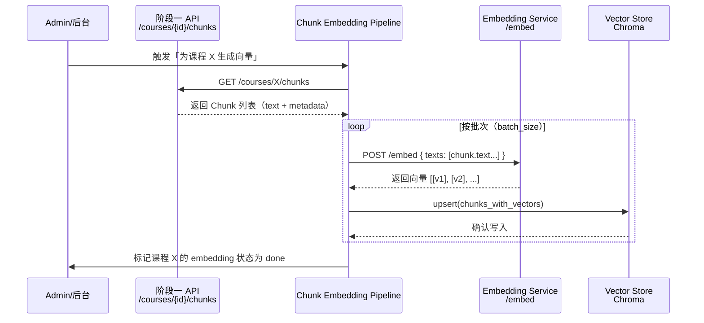
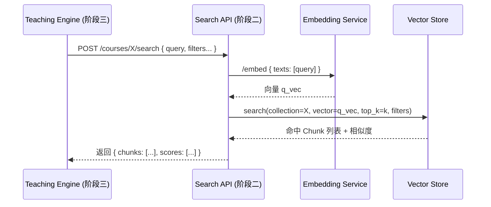

---

## 一、阶段二的目标（一句话版）

> 在阶段一已经能稳定产出 `Chunk` 的前提下，
> **阶段二负责：**
>
> * 把这些 Chunk 向量化（Embedding）
> * 写入本地向量数据库（Vector Store）
> * 提供统一的“语义检索服务”（给阶段三的 Teaching Engine 使用）

阶段二本质上就是一个：

> **“知识向量化 + 语义检索层”**

---

## 二、三个阶段之间的边界 & 交互关系

先用一个总图把 Stage1 / Stage2 / Stage3 串起来：

```mermaid
flowchart LR
    subgraph S1[阶段一：Ingestion & 课程建模]
        A1[资源注册 API<br/>URL/文件] --> A2[资源处理队列 + Worker]
        A2 --> A3[视频/文档流水线<br/>转录/解析 → ContentPiece]
        A3 --> A4[Sectioning<br/>生成 Section]
        A4 --> A5[Chunk Builder<br/>生成 Ready-to-Embed Chunks]
        A5 -->|校验| A6[Chunk Schema Validator]
        A6 -->|通过| A7[Chunk 查询 API<br/>GET /courses/{id}/chunks]
    end

    subgraph S2[阶段二：向量服务 + 向量库]
        B1[Embedding Service<br/>Qwen3-Embedding] --> B2[Vector Store<br/>Chroma]
        B3[Chunk Embedding Pipeline] --> B1
        B3 --> B2
        B4[语义检索 API<br/>/courses/{id}/search] --> B1
        B4 --> B2
    end

    subgraph S3[阶段三：RAG + Teaching Engine]
        C1[Teaching Engine<br/>对话状态机 + Teacher Profile]
        C2[RAG 组装器<br/>检索 + Prompt 构建]
    end

    A7 -->|拉取 Chunks 做批量向量化| B3
    C2 -->|问题 → 语义检索| B4
    B4 -->|返回相关 Chunk + metadata| C2
    C2 -->|构造上下文 + Prompt| C1
```

### 边界说明：

* **阶段一 → 阶段二：**

  * 阶段一的“出口”：`GET /courses/{id}/chunks`（或 DB 中的 Chunk 表）
  * 阶段二的“入口”：Chunk 列表（符合 Ready-to-Embed schema）
  * 交互方式：

    * 后台 Batch Pipeline：按课程拉取所有 Chunk，批量向量化并写入向量库

* **阶段二 → 阶段三：**

  * 阶段二的“出口”：

    * `/embed` API（可选，对内）
    * `/courses/{id}/search` 检索 API（推荐）
  * 阶段三的“入口”：

    * “语义检索结果” = 一组 `{chunk_id, score, text, metadata}`

---

## 三、阶段二需要完成哪些事情（模块清单）

### 阶段二核心模块：

1. **Embedding Service（向量服务）**

   * 封装 Qwen3-Embedding-0.6B
   * 提供 `/embed` 接口，支持批量文本 → 向量

2. **Vector Store（向量库，Chroma）**

   * 为每门课/全局创建向量集合
   * 存储：embedding + chunk.text + chunk.metadata
   * 支持：按 course/section 过滤的 top-k 检索

3. **Chunk Embedding Pipeline（批量向量化流水线）**

   * 从阶段一的 Chunk API 拉取 chunk
   * 调用 Embedding Service
   * 写入 Vector Store
   * 有 per-course 的状态跟踪（embedding_done / in_progress / failed）

4. **Search API（对阶段三暴露的检索接口）**

   * `/courses/{course_id}/search`
   * 输入：用户问题 + 可选过滤（section_id/范围等）
   * 流程：问题 → embedding → 向量检索 → 返回 top-k Chunk

5. **监控 & 运维小能力**

   * 每门课的 embedding 状态
   * 向量库健康检查（简单即可）

---

## 四、阶段二内部交互 & 步骤拆解

### 4.1 阶段二内部结构关系图

```mermaid
flowchart LR
    subgraph EmbSvc[Embedding Service]
        ES1[Model Loader<br/>加载 Qwen3-Embedding] 
        ES2[Embedding API<br/>/embed]
        ES1 --> ES2
    end

    subgraph VStore[Vector Store (Chroma)]
        VS1[Collection 管理<br/>按课程/全局建集合]
        VS2[向量写入<br/>Upsert / Bulk Insert]
        VS3[向量检索<br/>Top-K Search + Filter]
        VS1 --> VS2
        VS1 --> VS3
    end

    subgraph Pipeline[Chunk Embedding Pipeline]
        P1[Chunk 拉取器<br/>调用 S1 /chunks API]
        P2[批量 embedding 调度<br/>调用 /embed]
        P3[写入向量库<br/>调用 VS2]
        P1 --> P2 --> P3
    end

    subgraph SearchAPI[语义检索 API 层]
        Q1[Query Embedding<br/>问题 → 向量]
        Q2[调用 VS3 检索]
        Q3[封装结果为 RAG 所需格式]
        Q1 --> Q2 --> Q3
    end

    Pipeline --> EmbSvc
    Pipeline --> VStore
    SearchAPI --> EmbSvc
    SearchAPI --> VStore
```

---

### 4.2 从“课程完成阶段一 → 完成向量化”的流程（Batch Embedding）



**关键点：**

* 这是一个**课程级批处理**：

  * 不在用户请求实时路径上
  * 可以在后台任务中跑（和阶段一相似的 queue/worker 模型）

---

### 4.3「阶段三发起问题 → 阶段二检索 → 返回上下文」流程（在线查询）



**Teaching Engine 不需要知道向量库细节，只与 Search API 对话。**

---

## 五、阶段二的步骤规划（任务分阶段）

我们再把阶段二拆成可执行的步骤（类似阶段一的 TODO）。

### Step 1：Embedding Service 落地

**目标：** 统一对外提供 `/embed` 接口，内部封装 Qwen3-Embedding-0.6B。

**子任务：**

1. 模型加载模块：

   * 初始化 Qwen3-Embedding-0.6B（GPU 优先，fallback CPU）
   * 支持批量输入文本 → [N × D] 向量

2. HTTP API 层（FastAPI）：

   * `POST /embed`
   * 输入：`{ "texts": [string...], "model": "qwen3-embedding-0.6b" }`
   * 输出：`{ "vectors": [[float...], ...] }`

3. 限流和批大小：

   * 例如：单次请求最多 64 条
   * 内部对长文本可以做截断（后续可优化）

---

### Step 2：Vector Store 初始化（Chroma）

**目标：** 确定向量库的组织方式。

**子任务：**

1. Collection 设计：

   * 方案 A：每个 course 一个 collection
   * 方案 B：一个大 collection，用 metadata.course_id 过滤
   * MVP 推荐 **每课程一个 collection**（简单隔离，方便删除）

2. 存储 schema：

   * id: `chunk_id`
   * embedding: 向量
   * document: `chunk.text`
   * metadata: Ready-to-Embed schema中的关键信息（course_id, lecture_id, section_id, ...）

3. 初始化 & 连接管理：

   * 在服务启动时初始化 Chroma client
   * wrapping 一层 VectorStoreService，隐藏底层细节

---

### Step 3：Chunk Embedding Pipeline（批量向量化）

**目标：** 从 Stage1 拉 Chunk → Embed → Upsert 到 Chroma。

**子任务：**

1. 拉取 Chunk：

   * 调用阶段一 API：`GET /courses/{id}/chunks`
   * 或直接查 DB 的 Chunk 表
   * 注意分页/分批加载（避免一次性取太多）

2. 调用 Embedding Service：

   * 按 batch_size 组装 texts
   * 发送到 `/embed`
   * 收到向量后，与对应 chunk.id / metadata 对齐

3. 写入 Vector Store：

   * 调用 Chroma 的 upsert接口：

     * ids: [chunk_id...]
     * embeddings: [[vec]...]
     * documents: [chunk.text...]
     * metadatas: [{...}, ...]

4. 嵌入状态记录：

   * 为 Course/Resource 增加一个字段：

     * `embedding_status`: `pending | processing | done | failed`
   * 提供一个简单 API 查看某门课的 embedding 状态

---

### Step 4：Search API（对阶段三暴露）

**目标：** 把底层的向量检索封装成简单的 HTTP 接口。

**示例设计：**

* `POST /courses/{course_id}/search`

请求体：

```json
{
  "query": "老师，请给我讲一下梯度下降的基本思想",
  "top_k": 5,
  "filters": {
    "section_id": "sec_01_03"
  }
}
```

响应：

```json
{
  "results": [
    {
      "chunk_id": "chunk_000123",
      "score": 0.89,
      "text": "...",
      "metadata": {
        "section_id": "sec_01_03",
        "lecture_id": "lec_01",
        "source_type": "transcript",
        ...
      }
    }
  ]
}
```

Teaching Engine 只用拿这个结果去拼 prompt。

---

### Step 5：监控 & 操作辅助（简单版）

* 查看课程 embedding 状态
* 手动触发/重跑 embedding pipeline：

  * `POST /courses/{id}/embed`
* 健康检查：

  * `/health/embed`
  * `/health/vector_store`

---

## 六、小结：阶段二的核心设计点（给你一句话总结）

* 阶段一负责：**“把课程内容变成结构化的 Chunk”**
* 阶段二负责：**“把 Chunk 变成可检索的向量空间”**
* 阶段三负责：**“用检索结果去驱动对话式教学”**

你现在已经有了：

* 阶段一 = ✅
* 阶段二 = 规划清楚了（Embedding Service + Chroma + Pipeline + Search API）
* 阶段三 = 上层教学逻辑，会像用户故事一样围绕课程/老师人格来设计。

---

